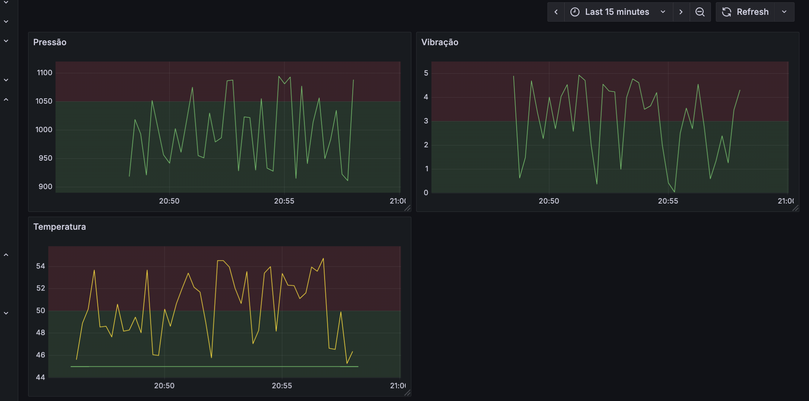

// Grafana - FEITO
// Interface regra de negocio - FEITO
// Algoritmo de eleicao- FEITO

// Definir os limites do go consumindo o mongo

------------------------------

RODAR O PRODUCER
go run main.go 1 Local1
go run main.go 2 Local1
go run main.go 3 Local1

RODAR O ANALYZER
go run ./cmd 1 127.0.0.1:8081 127.0.0.1:8081,127.0.0.1:8082,127.0.0.1:8083 9101
go run ./cmd 2 127.0.0.1:8082 127.0.0.1:8081,127.0.0.1:8082,127.0.0.1:8083 9102
go run ./cmd 3 127.0.0.1:8083 127.0.0.1:8081,127.0.0.1:8082,127.0.0.1:8083 9103

RODAR O MONGO

RODAR O TELEGRAM

RODAR O INTERFACE de limites

nicolasceruti@Nicolass-MacBook-Pro grafana-12.2.1 % ./bin/grafana-server

nicolasceruti@Nicolass-MacBook-Pro prometheus-3.5.0.darwin-amd64 % ./prometheus --config.file=prometheus.yml

